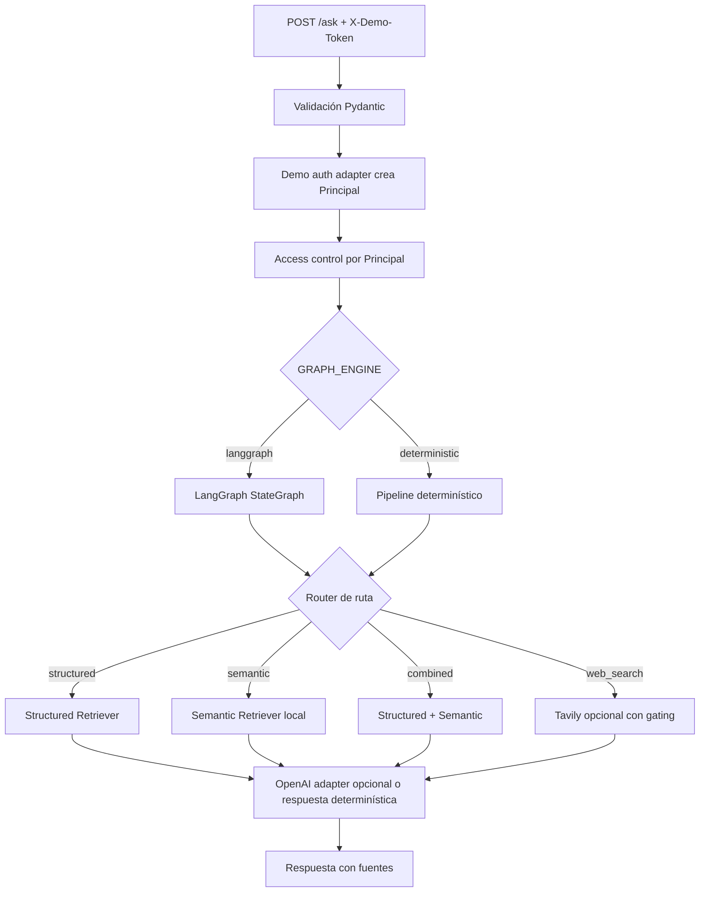

# Certilab Agentic RAG

MVP académico de un servicio RAG independiente para consultar certificados de calibración de Certilab con datos mock y comportamiento determinístico local. No usa datos reales, secretos, PDFs productivos ni claves externas.

## Qué resuelve

Permite preguntar por certificados desde dos caminos complementarios:

- **Búsqueda estructurada**: estados, fechas, cantidades y metadatos de certificados.
- **Recuperación semántica local**: contenido técnico simulado a partir de textos extraídos de PDFs mock.

Cada respuesta incluye fuentes con `certificate_id`, `code`, `customer_id`, tipo de fuente, `source_id` sanitizado y fragmento usado. La API no expone rutas internas de almacenamiento como citas.

## Arquitectura



## Tecnologías

- Python 3.11+
- FastAPI
- Pydantic v2 + pydantic-settings
- pytest
- LangGraph opcional como motor por defecto con fallback determinístico
- OpenAI adapter opcional para respuesta final en `APP_MODE=real`, con contexto minimizado y sanitizado
- Tavily opcional para consultas web públicas, bloqueando consultas privadas o customer-specific
- Chainlit opcional como UI demo
- Phoenix/OpenInference opcional para observabilidad segura
- Índice local determinístico para evitar depender de OpenAI/Qdrant durante la entrega

## Estructura

```text
app/                 API, pipeline, dominio, ingestión, recuperación, seguridad, tools y observability
app/tools/           Adaptadores opcionales para OpenAI, Tavily, MySQL y S3
app/observability/   Phoenix/OpenTelemetry con fallback no-op
data/mock/           Clientes, certificados e historiales anonimizados
data/pdf_text/       Texto mock equivalente a extracción de PDFs
docs/                Arquitectura y contrato de datos
notebooks/           Espacio reservado para exploración académica
tests/               Pruebas de acceso, retrieval y API
ui/                  UI demo con Chainlit
```

## Instalación

```bash
git clone <repo-url>
cd certilab-agentic-rag
uv sync --extra dev
mkdir -p ~/.config/certilab-agentic-rag
cp .env.example ~/.config/certilab-agentic-rag/.env
```

## Ejecutar

```bash
uv run uvicorn app.main:app --reload
```

Luego abrir:

- `http://127.0.0.1:8000/health`
- `http://127.0.0.1:8000/docs`

## Alineación con el stack del curso

El proyecto mantiene el modo mock determinístico y suma integraciones opcionales del curso: LangGraph `StateGraph`, OpenAI para modo real, Tavily para web search, Chainlit como UI demo y Phoenix/OpenInference para spans seguros.

## Entrega académica

Esta sección concentra la evidencia de entrega para revisión del curso. El proyecto sigue siendo mock-first: no requiere claves externas, PDFs reales, datos productivos ni servicios de terceros para ejecutar la demo principal.

| Evidencia | Ubicación |
|---|---|
| Referencia LevelUp | **Building an Adaptive RAG System with LangGraph, OpenAI and Tavily** — https://levelup.gitconnected.com/building-an-adaptive-rag-system-with-langgraph-openai-and-tavily-c4ee39d2f021 |
| Notebook offline | [`notebooks/certilab_agentic_rag_demo.ipynb`](notebooks/certilab_agentic_rag_demo.ipynb) |
| Guía de notebooks | [`notebooks/README.md`](notebooks/README.md) |
| Alineación técnica | [`docs/course-alignment.md`](docs/course-alignment.md) |

### Instrucciones del notebook

Abrí `notebooks/certilab_agentic_rag_demo.ipynb` para revisar un recorrido determinístico de `/ask` con datos mock. El notebook es offline, usa tokens placeholder como `<DEMO_CLIENT_101_TOKEN>` y muestra respuestas de ejemplo para rutas `structured`, `semantic` y `combined` con fuentes sanitizadas mediante `source_id`.

### Checklist de entrega

- [x] API FastAPI mock-first con endpoint `/ask` y aislamiento por `X-Demo-Token`.
- [x] Flujo RAG determinístico local con búsqueda estructurada, semántica y combinada.
- [x] Integraciones opcionales del curso documentadas sin exigir credenciales para la entrega.
- [x] Notebook offline y secret-free para revisión académica.
- [x] Fuentes sanitizadas sin rutas internas como citas públicas.
- [x] Pruebas y comandos de verificación documentados.

### Verificación de entrega

```bash
uv run pytest
uv run ruff check .
uv run mypy app
```

```bash
uv sync --extra dev --extra future-integrations --extra observability
uv run pytest
uv run ruff check .
uv run mypy app
```

Guía completa: [`docs/course-alignment.md`](docs/course-alignment.md).

Para Chainlit:

```bash
export CHAINLIT_DEMO_TOKEN=<DEMO_CLIENT_101_TOKEN>
uv run chainlit run ui/chainlit_app.py
```

La UI requiere `CHAINLIT_DEMO_TOKEN` explícito o, como fallback de menor privilegio, un token demo de cliente configurado. No usa el token admin por defecto.

## Ejemplos de consultas sanitizadas

```bash
curl -X POST http://127.0.0.1:8000/ask \
  -H 'Content-Type: application/json' \
  -H 'X-Demo-Token: <DEMO_CLIENT_101_TOKEN>' \
  -d '{"question":"<pregunta-sobre-certificados>"}'
```

```bash
curl -X POST http://127.0.0.1:8000/ask \
  -H 'Content-Type: application/json' \
  -H 'X-Demo-Token: <DEMO_ADMIN_TOKEN>' \
  -d '{"question":"<pregunta-sobre-procedimientos>"}'
```

```bash
curl -X POST http://127.0.0.1:8000/ask \
  -H 'Content-Type: application/json' \
  -H 'X-Demo-Token: <DEMO_TECHNICIAN_TOKEN>' \
  -d '{"question":"<pregunta-combinada>"}'
```

Configura los tokens demo en el archivo local externo `~/.config/certilab-agentic-rag/.env` usando placeholders locales. También podés apuntar a otra ruta con `CERTILAB_RAG_ENV_FILE=/ruta/operator.env`:

| Variable | Principal demo |
|---|---|
| `DEMO_ADMIN_TOKEN=<DEMO_ADMIN_TOKEN>` | admin global |
| `DEMO_TECHNICIAN_TOKEN=<DEMO_TECHNICIAN_TOKEN>` | technician global |
| `DEMO_CLIENT_101_TOKEN=<DEMO_CLIENT_101_TOKEN>` | client del customer 101 |
| `DEMO_CLIENT_202_TOKEN=<DEMO_CLIENT_202_TOKEN>` | client del customer 202 |

> Estos tokens no son secretos ni autenticación productiva. En producción se debe reemplazar el adaptador demo por identidad verificada desde Laravel, JWT, sesión o gateway interno antes de construir el `Principal`.

## Pruebas

```bash
uv run pytest
```

## Observabilidad con Phoenix

El tracing RAG con Phoenix/OpenInference es opcional y está desactivado por defecto. Al habilitarlo, Phoenix muestra spans de `/ask`, decisión de ruta, retrieval estructurado, retrieval semántico y flujo combinado con atributos seguros como rol, ruta, conteo de fuentes, certificados y latencias aproximadas. No se trazan preguntas completas ni secretos.

Ver la guía paso a paso en [`docs/observability.md`](docs/observability.md).

## Buenas prácticas incluidas

- Separación entre servicio IA/RAG y Laravel productivo.
- Aislamiento por cliente en cada consulta.
- Fixtures mock sin PII ni secretos.
- Stubs explícitos para MySQL, S3 y Tavily.
- Respuestas trazables con fuentes.
- Citas sanitizadas mediante `source_id`, sin exponer rutas internas.
- Diseño runnable sin LLM ni API keys.

## Variables de entorno

Ver `.env.example`. Para el MVP local no se requiere ninguna clave externa.

Por defecto, la aplicación no carga secretos desde el repositorio. Si existe `~/.config/certilab-agentic-rag/.env`, se carga como archivo local de operador ignorado por Git. Para usar otra ubicación, exportá `CERTILAB_RAG_ENV_FILE=/ruta/operator.env`. Las pruebas deshabilitan esta carga con `CERTILAB_RAG_DISABLE_DOTENV=true` para mantenerse determinísticas.

El modo por defecto es `APP_MODE=mock`, por lo que el repositorio público sigue corriendo con fixtures locales. Para preparar un modo real local con credenciales propias de OpenAI, MySQL read-only y S3 least-privilege, ver [`docs/real-integration.md`](docs/real-integration.md). No copies ni commitees secretos.

Variables reservadas para integración real opcional:

- `APP_MODE`
- `GRAPH_ENGINE` (`langgraph` por defecto; `deterministic` para forzar el pipeline local sin LangGraph)
- `OPENAI_API_KEY`
- `OPENAI_EMBEDDING_MODEL`
- `OPENAI_CHAT_MODEL`
- `TAVILY_API_KEY`
- `QDRANT_URL`
- `QDRANT_COLLECTION` (default: `certilab-rag`)
- `QDRANT_API_KEY`
- `EMBEDDING_PROVIDER` (`auto` | `openai` | `local`)
- `SENTENCE_TRANSFORMERS_MODEL`
- `MYSQL_READONLY_DSN`
- `DB_HOST`, `DB_PORT`, `DB_DATABASE`, `DB_USERNAME`, `DB_PASSWORD`
- `S3_BUCKET_NAME`
- `AWS_REGION`
- `AWS_ACCESS_KEY_ID`, `AWS_SECRET_ACCESS_KEY`, `AWS_DEFAULT_REGION`, `AWS_BUCKET`, `AWS_STORAGE_PREFIX`, `CERTIFICATES_STORAGE_DISK`
- `PHOENIX_ENABLED`, `PHOENIX_PROJECT_NAME`, `PHOENIX_COLLECTOR_ENDPOINT`

## Limitaciones

- El índice semántico es una aproximación determinística por tokens, no embeddings reales.
- No extrae PDFs: usa textos `.txt` mock ya extraídos.
- No autentica usuarios reales; usa un adaptador demo por `X-Demo-Token` para derivar un `Principal` local.
- La política de técnicos está abierta: en producción debe configurarse según permisos reales.
- La generación OpenAI y Tavily degradan a respuesta determinística/fallback si faltan claves, dependencias o si la consulta no es segura para salir del entorno local.

## Próximos pasos

1. Agregar autenticación real desde Laravel o un gateway interno.
2. Crear export seguro de MySQL con allowlist de columnas.
3. Extraer texto de S3 solo después de autorizar `customer_id`.
4. Indexar chunks en Qdrant con filtros obligatorios por tenant.
5. Evaluar retrieval con preguntas etiquetadas antes de sumar generación LLM.

## Stack real (MySQL → Qdrant)

El modo real (`APP_MODE=real`) integra MySQL verificado, Qdrant y OpenAI embeddings con fallback local. Ver [`docs/real-integration.md`](docs/real-integration.md) para la guía completa.

### Iniciar Qdrant con Docker

```bash
docker compose up -d qdrant
```

Qdrant expone REST en `http://localhost:6333` y gRPC en `localhost:6334`.

### Configurar modo real

```env
APP_MODE=real
DB_HOST=127.0.0.1
DB_DATABASE=certilab_test
DB_USERNAME=readonly
DB_PASSWORD=<tu-password-read-only>
QDRANT_URL=http://localhost:6333
QDRANT_COLLECTION=certilab-rag
EMBEDDING_PROVIDER=auto
```

### Variables de entorno del stack real

- `APP_MODE` (`mock` | `real`)
- `QDRANT_URL` — URL del Qdrant local o cloud
- `QDRANT_COLLECTION` — nombre de la colección (default: `certilab-rag`)
- `QDRANT_API_KEY` — API key opcional para Qdrant Cloud
- `EMBEDDING_PROVIDER` (`auto` | `openai` | `local`) — selección de proveedor de embeddings
- `SENTENCE_TRANSFORMERS_MODEL` — modelo local para fallback offline (default: `all-MiniLM-L6-v2`)
- `OPENAI_API_KEY`, `OPENAI_EMBEDDING_MODEL`, `OPENAI_CHAT_MODEL`
- `DB_HOST`, `DB_PORT`, `DB_DATABASE`, `DB_USERNAME`, `DB_PASSWORD`

### Pruebas de integración

Las pruebas marcadas con `@pytest.mark.requires_qdrant` y `@pytest.mark.requires_mysql` se saltan automáticamente si no hay servicios disponibles:

```bash
# Hermético (sin servicios)
uv run pytest

# Con Qdrant + MySQL (requiere servicios corriendo)
QDRANT_URL=http://localhost:6333 DB_HOST=127.0.0.1 APP_MODE=real \
  uv run pytest tests/integration/ -v
```
