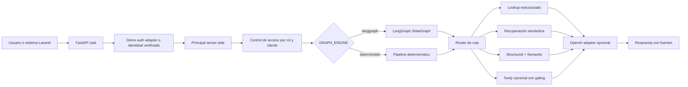

# Arquitectura del Agentic RAG para Certilab

Este proyecto implementa un servicio independiente de IA/RAG para consultar certificados de calibración. Soporta dos modos: **mock** (datos locales, determinístico, sin dependencias externas) y **real** (MySQL + Qdrant + embeddings OpenAI/local).

## Caso de uso

Certilab gestiona clientes, técnicos, certificados emitidos, historiales, metadatos en MySQL y documentos PDF almacenados en Amazon S3. El servicio permite hacer preguntas sobre certificados respetando el aislamiento por cliente.

## Flujo de alto nivel

### Datos según el modo activo

| Componente | APP_MODE=mock | APP_MODE=real |
|---|---|---|
| Loader | JSON fixtures en `data/mock/` | `MySQLLoader` → BD de pruebas vía `DB_*` |
| Vector index | `InMemoryVectorIndex` (bag-of-words coseno) | `QdrantVectorIndex` (Qdrant vía Docker) |
| Embeddings | Ninguno (tokens determinísticos) | `EmbeddingsProvider` (OpenAI → sentence-transformers → zero-vector) |

## Decisiones de arquitectura

| Área | Decisión |
|---|---|
| Servicio | Python/FastAPI independiente del Laravel productivo. |
| Modo por defecto | `APP_MODE=mock` — sin dependencias externas, determinístico, hermético para tests. |
| Motor de grafo | `GRAPH_ENGINE=langgraph` por defecto; fallback a pipeline determinístico si no está instalado. |
| Loader protocol | `CertificateLoader` protocol en `app/ingestion/protocols.py`; implementaciones mock y MySQL intercambiables. |
| Vector index protocol | `VectorIndex` protocol en `app/retrieval/protocols.py`; implementaciones `InMemoryVectorIndex` (mock) y `QdrantVectorIndex` (real). |
| Embeddings | `EmbeddingsProvider` con cadena OpenAI → sentence-transformers → zero-vector; sin requerir API key en mock. |
| Seguridad | La API deriva un `Principal` server-side; toda consulta aplica filtro de rol y `customer_id` antes de recuperar. |
| PII | `password`, `plain_password`, `remember_token`, `ruc`, `email`, `phone` excluidos del conector, el loader, los embeddings y los snippets. La tabla `users` no se consulta. |
| Citas | Las respuestas usan `source_id` sanitizado; las rutas internas de almacenamiento no se exponen. |
| OpenAI | Adapter opcional en `APP_MODE=real`; envía conteos y snippets minimizados/sanitizados. |
| Tavily | Web search opcional para consultas públicas genéricas; bloquea términos customer-specific, secretos y rutas. |
| UI | `ui/chainlit_app.py` expone una demo Chainlit con token explícito o fallback least-privilege de cliente. |
| Observabilidad | `app/observability` configura Phoenix/OpenTelemetry opcional; degrada a no-op si falla. |

## Módulos principales

- `app/main.py` — FastAPI, configuración y endpoints `/health` y `/ask`.
- `app/graph.py` — factory de pipeline; selecciona loader e índice según `app_mode`.
- `app/graph_langgraph.py` — implementación `StateGraph` con nodos de routing, retrieval y generación.
- `app/ingestion/protocols.py` — `CertificateLoader` protocol.
- `app/ingestion/loader.py` — `MockCertificateLoader` (JSON fixtures).
- `app/ingestion/mysql_loader.py` — `MySQLLoader` (MySQL real → modelos canónicos).
- `app/retrieval/protocols.py` — `VectorIndex` protocol.
- `app/retrieval/semantic.py` — `SemanticRetriever`; acepta cualquier `VectorIndex`.
- `app/retrieval/qdrant_index.py` — `QdrantVectorIndex` con filtro por tenant e init idempotente.
- `app/tools/mysql_connector.py` — queries SELECT con allowlist de columnas y validación anti-PII.
- `app/tools/embeddings.py` — `EmbeddingsProvider` con fallback OpenAI → local → zero-vector.
- `app/tools/` — adaptadores opcionales para OpenAI, Tavily y S3.
- `app/observability/` — tracing Phoenix/OpenTelemetry con spans seguros.
- `ui/` — UI demo Chainlit.

## Roles y alcance

- `admin` — puede consultar todos los registros visibles.
- `technician` — puede consultar todos los registros; en producción configurable según política operativa.
- `client` — requiere `customer_id` y solo puede consultar certificados de ese cliente.

En el MVP local, `X-Demo-Token` selecciona un principal demo desde una allowlist. En producción, Laravel, JWT, sesión o un gateway interno deben verificar la identidad antes de construir el `Principal`.

## Fuentes RAG permitidas

- Metadatos de certificados (columnas allowlisted).
- Historiales operativos sin PII sensible.
- Metadatos del cliente (solo `id` y `company_name`).
- Texto extraído de PDFs previamente autorizado por cliente (scope futuro: S3).

Excluidos: `password`, `plain_password`, `remember_token`, `ruc`, `email`, `phone`, PDFs sin autorización, y cualquier columna fuera de la allowlist.

## Próximos pasos

1. Extraer texto desde PDFs en S3 usando URLs firmadas y validación de tenant.
2. Agregar evaluación de recuperación con precision@k, recall@k y casos por cliente.
3. Reemplazar el adaptador demo por autenticación real desde Laravel, JWT o gateway interno.
